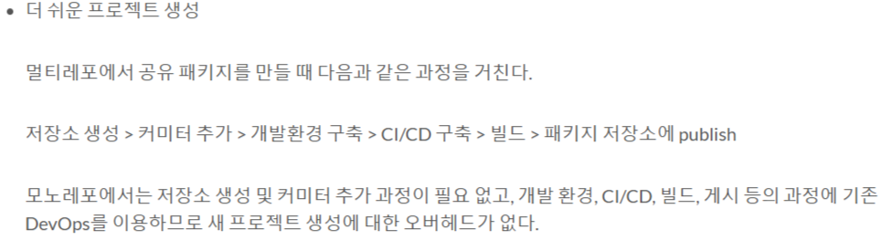
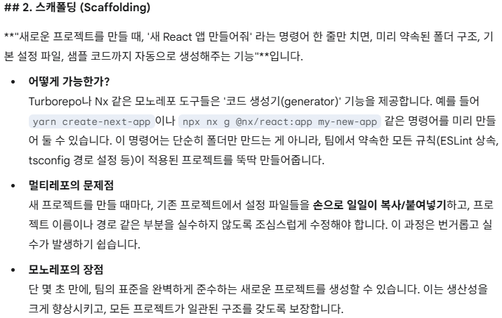
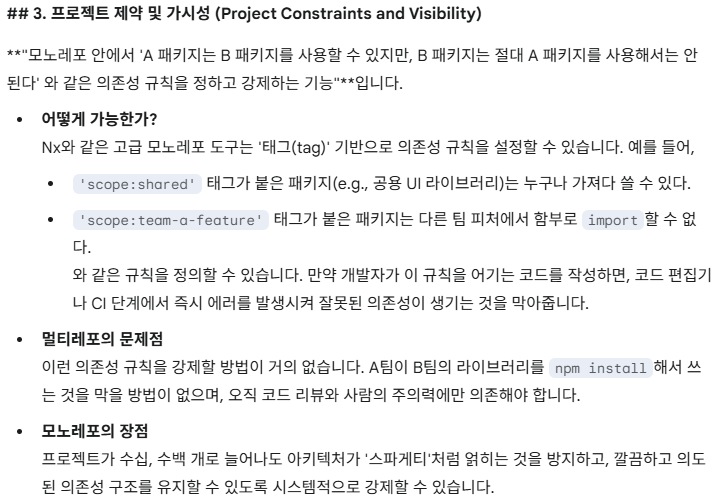

# 환경 표준화 및 기술 스택별 설정 공유

## 문제 정의

여러 Next.js 앱이나 React 라이브러리들이 각자 동일한 내용의 ESLint, TypeScript 설정을 개별적으로 보유하고 있어서 이게무슨문제지?

일단 새 프로젝트 시작시 힘들었는데 스캐폴딩하느라.
근데 이얘기 어디 블로그에 있었음.

---

## 성과 정의

* **기술 스택별 설정 모듈화**: React용 설정, Next.js용 설정 등을 패키지 단위로 분리하여 필요한 프로젝트에서 즉시 조립(Composition)할 수 있는 구조 구축.
* **설정 업데이트 일원화**: 공통 스택 설정 패키지의 규칙 한 곳만 수정하면 이를 사용하는 모든 하위 프로젝트에 즉각 반영됨.
* **개발자 경험 최적화**: 새로운 프로젝트 추가 시 코어 스택에 맞는 프리셋(Preset)을 가져다 쓰기만 하면 되므로 환경 설정에 드는 노력이 0에 수렴함.

---

## 수치화 지표

| 지표명 | 측정 방법 | 목표치 |
| :--- | :--- | :--- |
| 스택 설정 재사용률 | (공통 프리셋을 사용하는 프로젝트 수 / 전체 프로젝트 수) * 100 | 100% 달성 |
| 프로젝트별 설정 복잡도 | 각 프로젝트 내 개별 설정 파일(.eslintrc, tsconfig)의 라인 수 | 10줄 이내 |
| 일관성 검사 통과율 | 모든 프로젝트에 동일한 코어 규칙이 적용되어 통과되는 비율 | 100% 통과 |
| 규칙 업데이트 반영 시간 | 코어 스택 규칙 변경 시 전 프로젝트 반영에 걸리는 시간 | 1분 이내 (자동화) |

---

## 상세 실행 전략

### 새 프로젝트 부트스트랩

폴리레포에서 공유 패키지를 새로 만들 때마다 저장소 생성 → 커미터 추가 → 개발환경 구축 → CI/CD 구축 → 빌드 → publish 과정을 거쳐야 합니다. 모노레포는 이 모든 과정을 기존 인프라로 대체하므로 새 프로젝트 생성 비용이 거의 0에 수렴합니다.

스캐폴딩(Scaffolding) 도구를 함께 사용하면 새 프로젝트 생성 시 팀의 ESLint·tsconfig·폴더 규칙이 자동으로 적용됩니다.

### 의존성 관계 가시성

프로젝트 간 `import` 규칙을 태그 기반으로 강제할 수 있어 아키텍처가 시간이 갈수록 스파게티가 되는 것을 시스템적으로 방지합니다.

### 코드 소유권

`CODEOWNERS`로 폴더 단위 소유권을 명시하면 모노레포에서도 다른 팀이 모르는 사이 내 코드를 변경하는 일을 방지할 수 있습니다.

