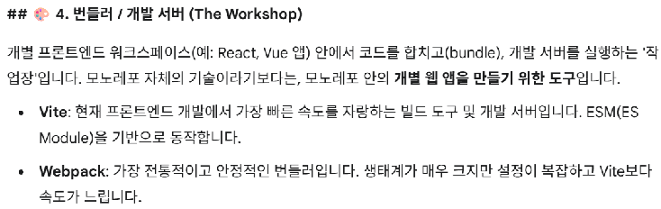

# 번들러 비교 분석 및 빌드 시스템 구축

4단계는 프로젝트의 목적과 규모에 따라 최적의 번들러를 선정하고, 각 패키지의 소스 코드를 실행 가능한 형태로 변환하는 표준화된 빌드 체계를 수립하는 단계입니다.

---

## 문제 정의

* **기술 종속성 위험**: 특정 번들러의 장단점을 충분히 고려하지 않고 선택하여, 향후 프로젝트 확장 시 빌드 속도 저하나 설정의 한계에 부딪힘.
* **빌드 효율 불투명**: 최신 도구와 기존 도구 간의 성능 차이를 객관적으로 파악하지 못해 개발 생산성 개선 기회를 놓침.
* **복잡한 설정 관리**: 모노레포 내 여러 프로젝트가 서로 다른 빌드 도구를 무분별하게 사용할 경우 유지보수 비용이 급격히 상승함.

---

## 성과 정의

* **최적의 번들러 선정**: 프로젝트의 요구사항(속도, 생태계, 안정성)을 바탕으로 논리적인 근거를 갖춘 빌드 도구를 선정함.
* **표준 빌드 파이프라인 구축**: 선정된 도구를 활용해 ESM, CJS 등 다양한 환경에 대응하는 결과물을 일관되게 생성하는 구조를 확립함.
* **개발자 경험 혁신**: 빠른 피드백 루프(HMR)를 제공하여 디자인 시스템 및 앱 개발 속도를 비약적으로 향상함.

---

## 수치화 지표

| 지표명 | 측정 방법 | 목표치 |
| :--- | :--- | :--- |
| 번들러 벤치마크 점수 | 빌드 속도, HMR 속도, 결과물 크기 비교 평점 | 종합 1위 도구 선정 |
| 개발 서버 구동 속도 | 냉간 시동(Cold Start)부터 준비 완료까지 시간 | 2초 이내 |
| 트리 쉐이킹 효율 | 사용하지 않는 코드의 제거 비율 확인 | 95% 이상 제거 |
| 빌드 설정 코드량 | 프로젝트별 개별 빌드 설정 라인 수 | 공통 설정 상속을 통해 최소화 |

---

## 상세 실행 전략

### 후보군 비교 분석

주요 번들러 및 빌드 도구의 특성을 우리 프로젝트 상황에 대입하여 평가합니다.

* **바이트 (Vite)**: ES 모듈을 활용하여 개발 서버 구동이 매우 빠르며 설정이 직관적임. 리액트 및 최신 프런트엔드 생태계와 결합력이 우수함.
* **웹팩 (Webpack)**: 가장 방대한 생태계와 플러그인을 보유함. 매우 복잡하고 세밀한 빌드 최적화가 필요한 대규모 레거시 프로젝트에 적합함.
* **알에스빌드 (Rsbuild/Rspack)**: 웹팩의 유연함과 Rust 기반의 압도적인 빌드 속도를 결합한 도구. 대규모 프로젝트에서 빠른 빌드가 필요할 때 강력한 대안임.
* **롤업 (Rollup)**: 주로 라이브러리 배포용 결과물을 만드는 데 특화됨. 결과물 크기가 작고 깨끗하여 디자인 시스템 패키지에 유리함.

### 선정 기준 수립

* **개발 속도**: 코드 수정 후 브라우저에 반영되는 시간(HMR)과 초기 실행 속도.
* **생태계 및 호환성**: 필요한 플러그인의 존재 여부 및 Next.js 등 코어 프레임워크와의 호환성.
* **러닝 커브**: 팀원들이 설정을 이해하고 유지보수하는 데 드는 비용.

### 빌드 시스템 구현

* **라이브러리 모드 설정**: 디자인 시스템과 같이 배포가 필요한 패키지는 여러 모듈 형식을 지원하도록 설정합니다.
* **공통 빌드 프리셋**: 모든 패키지가 동일한 빌드 도구 버전과 기본 설정을 공유하도록 루트 레벨에서 관리합니다.

---

## 번들러·개발 서버 비교

